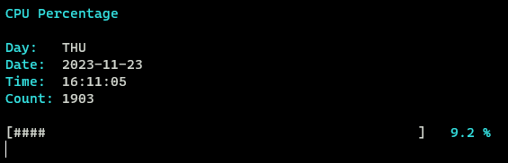
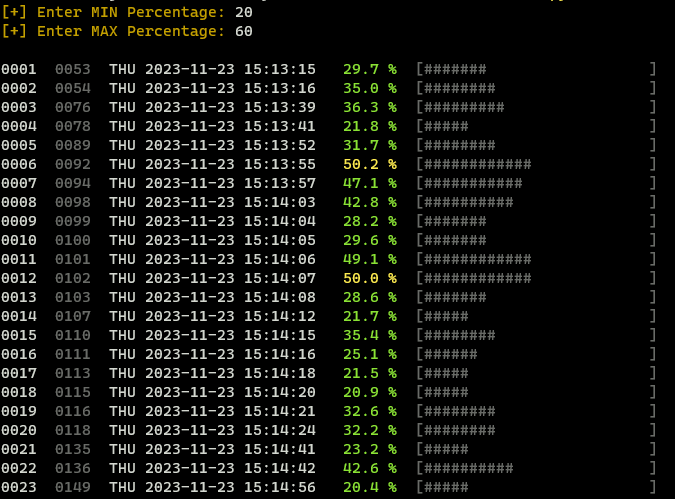

# CPUMonitoringCLI

## Screenshots
monitor.py\
\

check_log.py\

## Description
This tool written in python logs your cpu in percentage.
You can filter the log.txt file with the check_log.py script to see the results.
In the check_log.py script you can set the range of the cpu percentage.
You can set the range between the maximun and the minimun value to get the results you want to have.

## Requirements
- psutil
- colorama

## Platform
- Windows
